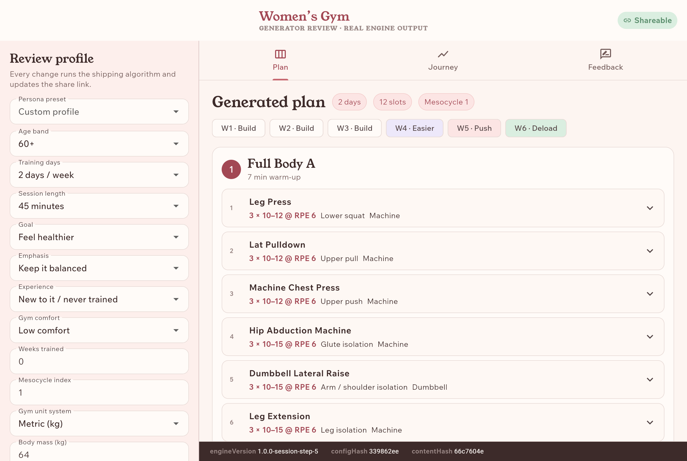
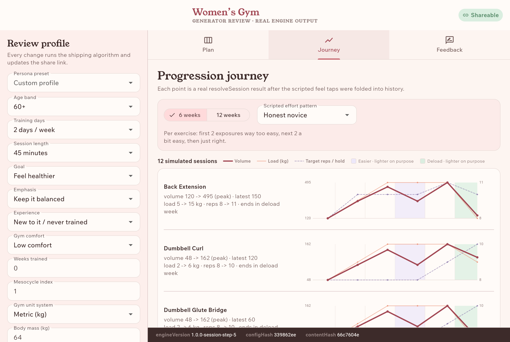

# Bloom

The gym app made for women. It plans around your life, your energy and your period, then coaches you through every set.

- App Store: https://apps.apple.com/app/id6795461055
- Google Play: https://play.google.com/store/apps/details?id=io.rosenpin.womensgym
- Website: https://womensgym.github.io/bloom-site/
- Demo video: https://youtu.be/g8YY0nkYSRU
- Engine explorer: https://rosenpin.github.io/bloom/

Built for RevenueCat Shipaton 2026. Bloom is a work in progress.

## What's here

```
app/                          Flutter app (iOS and Android)
packages/programming_engine/  the training engine, pure Dart
review_site/                  engine explorer: Flutter web app running the real engine (live on GitHub Pages)
supabase/migrations/          Postgres schema, row-level security, content seed
.github/workflows/            CI and the TestFlight release pipeline
```

## Engine explorer



*Input: the "Ruth, 63" persona. Age 60+, two days a week, 45 minutes, goal "feel healthier", new to lifting, low gym comfort. Output: two full-body days built on machines, a 7-minute warm-up and a gentler effort target. The strip above the plan shows the six-week mesocycle with its easier week 4 and deload week 6.*



*The same profile on the Journey tab: 12 simulated sessions with scripted feel answers ("way too easy" twice, "a bit easy" twice, then "just right"), each folded back through the engine. Volume climbs, dips in the easier week while loads hold, and drops on purpose in the deload week.*

`review_site/` is how the engine gets reviewed. Every profile change reruns the real engine, the profile lives in the URL so a plan can be shared, and reviewers leave notes that stay in the browser and export as JSON. Its header still shows the app's working title from before it was called Bloom. Try it at https://rosenpin.github.io/bloom/, or run it with `cd review_site && flutter run -d chrome`.

## How the engine works

*Work in progress. This describes the engine as it is in this repo; tuning values live in `ProgrammingConfig`.*

### Inputs

The onboarding quiz becomes a `Profile`: age band, training days (2 to 4), session length (30, 45 or 60 minutes), goal, emphasis area, experience, gym comfort and weeks trained. Body mass is optional and only feeds progression. The engine sees enums and numbers, never screens.

Period dates live in the app, not the engine. Onboarding asks for them, and Today shows roughly where she is in her month with plain observations. The engine does not change training by menstrual phase yet; that waits on a proper read of the research.

### Plan assembly

`assemblePlan(profile, config, catalog)` builds the plan in one deterministic pass.

- **Split by days.** Two days are full-body A and B. Three days are Lower / Upper / Full Body, or Lower / Upper / Lower with a glute emphasis. Four days are Lower / Upper / Lower / Upper.
- **Session length sets the exercise count**, from 4 at 30 minutes to 7 or 8 at 60.
- **Slots, not fixed workouts.** Each day is a list of block roles (squat, hinge, push, pull, isolation, core, cardio finisher), filled in order from ranked, eligible candidates, with no repeats within a day and, where the catalog allows, within the week.
- **Emphasis** adds one more occurrence of that area. Glute isolation opens the lower days.
- **Age-aware, without branching.** Experience, age and gym comfort add up to a machine-affinity score. That score, a seated preference and an age-based warm-up length all feed one ranking. Hard age and safety eligibility never relax.
- **No weights in the plan.** Each exercise gets sets, a rep range and an internal effort target, with the scheme set by the goal.
- **Six-week mesocycle.** Three build weeks, an easier week 4 (less volume, same weights), a push week 5 and a lighter deload week 6. The week shape is three config vectors applied to one base dose, not separate logic. Rotating slots move to their next variation each mesocycle, so a new block feels new without any randomness.

### Loads snapped to real equipment

Loads are suggested at session time from her own history for that exercise. Each equipment family has a ladder of loads that exist, per unit system: EU dumbbells in 2 kg steps, US dumbbells in 5 lb, machine pins, plates, and assisted machines as negative load. A suggestion rounds down to a real weight and adds reps to cover the gap. The math runs on effective load, including the share of body weight the movement moves, so a bodyweight squat can progress too.

### Progression

- **Double progression.** Reps climb through the range first, then the weight steps up and reps start low again.
- **One feel answer drives it.** After the last set of an exercise she can tap one of five answers, from "way too easy" to "too hard", which map to internal effort bands. "Just right" still moves her forward. "Too easy" moves faster, capped at a step or two. "Too hard" never adds load.
- **Conservative defaults.** No answer means no increase. Beginners stay well short of failure. A lift that stalls backs off and builds again.
- **Time away.** After a grace period, loads come down on one smooth curve. A long break re-finds working weights on the main lifts.
- **Explained.** Every decision carries reason codes, which the app turns into plain copy like "we'll add a little next time".

### In-session adaptation

`advanceSession(state, event)` is one reducer. The events are set completed, feel reported, swap requested, shorten, low energy, pain and abandoned.

- **Swaps** walk a ranked graph with three compatibility tiers and a reason: busy, intimidating, uncomfortable or unavailable. A swapped-in exercise uses its own history, never the old one's numbers.
- **Shorten to N minutes** drops isolation from the end. The main lifts stay.
- **Low energy** keeps the same exercises, lightens the load and aims for the bottom of the rep range.
- **Pain** stops that exercise and keeps it out of future suggestions.
- **Calibration.** The first time she meets an exercise, a probe starts light and asks for 8 easy reps and one feel answer. It takes at most two test sets to settle a working weight.

### Deterministic and pure

The engine has no Flutter, no I/O, no async and no clock: today's date is always a parameter. There is no randomness, so the same answers produce byte-identical plans. The append-only session event log is the source of truth, and per-exercise state is a fold over it, so two devices converge by replaying the same events. Decisions are stamped with the engine version, a config hash and a content hash.

That makes the engine cheap to test thoroughly. Its 289 tests include:

- decision-table tests that encode the progression rules row by row
- plan snapshots for 14 personas
- journey goldens: a novice squat, a layoff, a stall, a deload week and an assisted pull-up
- invariants: no answer never raises a load, "too hard" never raises it, every load exists on its equipment, and running twice gives identical output

### How the app calls it

`app/lib/core/programming_engine_facade.dart` wraps `assemblePlan` and the load suggester for plan generation. The session player calls `resolveSession` to prescribe today's workout and `advanceSession` for every tap. Each event goes to Drift first, then syncs through the outbox.

## Run it

You need Flutter 3.44 or newer (CI pins 3.44.5).

```sh
# The engine is plain Dart and has its own test suite.
cd packages/programming_engine
dart pub get
dart test

# The app
cd ../../app
flutter pub get
dart run build_runner build --delete-conflicting-outputs
flutter run

# The engine explorer
cd ../review_site
flutter pub get
flutter run -d chrome
```

Generated files (`*.g.dart`, `*.freezed.dart`, Drift output) are not committed, so run build_runner after every fresh checkout.

**Sync is optional.** The app runs fully offline, with Drift as its only store. To sync to your own Supabase project, apply `supabase/migrations/`, then create `app/env.json`:

```json
{
  "SUPABASE_URL": "https://your-project.supabase.co",
  "SUPABASE_PUBLISHABLE_KEY": "your-publishable-key"
}
```

Then run `flutter run --dart-define-from-file=env.json`. Only the publishable key belongs in the app, never a secret key. `env.json` is gitignored.

**Exercise images and videos are not included.** `pubspec.yaml` still lists `assets/images/` and `assets/videos/`. Flutter reports them as missing but still builds, and creating the empty folders silences the message. Screens that show exercise photos will have no pictures. The widget tests that load them fail too: 45 of 91 app tests pass without the media, and all 91 pass with it.

## The app

- Flutter (iOS and Android), Dart 3
- Riverpod with codegen (`@riverpod`). Providers are top level and overridable, so tests inject fakes.
- go_router for the onboarding flow, the three-tab shell and the full-screen workout
- Drift (SQLite) as the offline-first source of truth, synced to Supabase through a local outbox
- RevenueCat `purchases_flutter` behind a custom paywall, no prebuilt paywall UI
- freezed and json_serializable for app-layer models

```
app/lib/
  main.dart                  startup: optional Supabase init, RevenueCat, then the app
  app.dart                   root widget
  core/
    navigation/              go_router routes, redirects, page transitions
    theme/                   color, type, spacing, radius, size and motion tokens
    providers.dart           top-level providers
    version_gate.dart        minimum-version check that fails open
    revenuecat_config.dart   public SDK key and entitlement id
    programming_engine_facade.dart   the seam to the engine
  data/
    db/                      Drift schema and database
    sync/                    outbox repository, Supabase remote, sync service
    auth/                    anonymous Supabase sign-in
    analytics/               app_events logger with a per-event property allowlist
  features/
    onboarding/              the quiz and its saved answers
    plan/                    plan generation service, storage codec, plan reveal, day detail
    session/                 the guided workout: sets, rests, swaps, exercise visuals
    tabs/                    Today, Plan and Me
    history/                 finished-session summaries
    paywall/                 entitlement service over RevenueCat, paywall screen
```

Features use the layers they need: `domain/` (pure view logic), `data/` (Drift repositories), `application/` (services that call the engine) and `presentation/` (widgets).

### Offline first, with an outbox

Drift is the source of truth. The app works fully offline, including in a gym basement with no signal. Each local write also queues a row in the `outbox` table. `SyncService` drains the outbox to Supabase in order, so parents land before children. It retries with capped backoff, and append-only tables upsert with conflict-ignore. A failing analytics row is stepped over, so it never holds back a plan or a session. On a fresh install, sync restores the profile and plan from the server.

### Purchases

The RevenueCat app user id is the anonymous Supabase user id, so a membership follows the same identity that owns the synced data. The paywall is custom Flutter UI built on offerings, trial eligibility, purchase, restore and code redemption. It gates premium routes through the `premium` entitlement.

### CI

These are the private repo's workflows, kept for reference. GitHub Actions are disabled on this public mirror, so they do not run here. `ci.yml` runs analyze and tests for the engine, the app and the engine explorer. `testflight.yml` ships an iOS beta from the private repo and needs signing secrets and release scripts that are not in this one.

## Notice

The MIT license in `LICENSE` covers the source code in this repository. It does not cover the Bloom name, logo, app icon or other brand assets, or any exercise imagery. Those remain all rights reserved.

The bundled fonts, Wix Madefor Text and Young Serif, belong to their authors and are licensed under the SIL Open Font License 1.1. The license notice is embedded in each font file.
